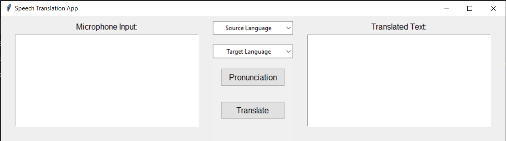
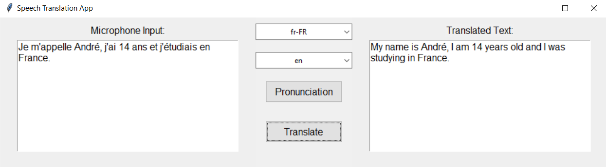

# Speech Translation App

The Speech Translation App is a Python application that enables users to perform real-time speech translation using Azure Cognitive Services Speech SDK. The application provides a user-friendly graphical interface for translating spoken language from a microphone input to a target language. Additionally, it includes pronunciation feedback using the Azure Text to Speech service.

**Note:** **Note:** User authentication is handled by generating a token through Microsoft's authentication process. This authentication token is **crucial** for synchronous usage of multiple Azure services, including speech services, translator, GPT for prompts, etc. Instead of using multiple API Keys for each service, the authentication token streamlines the authentication process, providing a more unified and efficient approach. For more details on the authentication process, please refer to [Microsoft Azure Authentication](https://docs.microsoft.com/en-us/azure/cognitive-services/authentication?tabs=python) and [Generate an Auth Token](https://learn.microsoft.com/en-us/azure/energy-data-services/how-to-generate-auth-token).

## Table of Contents

- [Features](#features)
- [Prerequisites](#prerequisites)
- [Setup](#setup)
- [Usage](#usage)
- [Examples](#examples)


## Features

- Real-time speech translation
- Graphical User Interface (GUI) using Tkinter
- Pronunciation feedback using Azure Text to Speech service

## Prerequisites

Before running the application, ensure you have the following:

- Python 3.x
- Required Python libraries (install using `pip install -r requirements.txt`)
- Azure Cognitive Services Speech SDK Authorization Token and region
- Azure Text to Speech service Authorization Token and region

## Setup

1. **Clone the repository:**

   ```bash
   git clone https://github.com/andrei2timo/app-translator.git

2. **Install the required dependencies:**
   ```bash
   pip install -r requirements.txt

3. **Configure Azure Cognitive Services Speech SDK and Azure Text to Speech service:**
   - Replace <your-speech-sdk-key> and <your-speech-sdk-region> in speech_translator.py with your Speech SDK subscription key and region.
   - Replace <your-text-to-speech-key> and <your-text-to-speech-region> in text_to_speech.py with your Text to Speech service subscription key and region.

4. **Usage:**
   
   ```bash
   python gui.py
   
Follow the on-screen instructions to select the source and target languages, then click the "Translate" button to initiate speech translation. Use the "Pronunciation" button to hear the translated text.

## Examples:
   ### Example 1: User Interface
   

   *Caption: The graphical user interface allows users to select source and target languages, providing a seamless experience for speech translation.*

   ### Example 2: Application Usage
   
*Caption: The graphical user interface allows users to select source and target languages. In this example, French is chosen as the source language, and English as the target language. The interface displays the spoken text from the microphone in French, translates it into English in real-time, and presents the translated text on the screen.*
